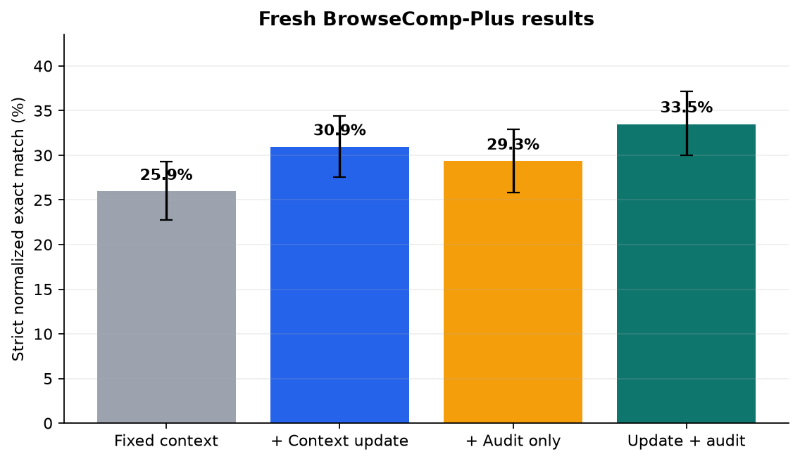

# AREX inference-mechanism reproduction

We tested two claims from [AREX: Towards a Recursively Self-Improving Agent for Deep Research](https://alphaxiv.org/abs/2607.21461): that an agent benefits from replacing a long research history with its own compact state, and that auditing every question constraint before another targeted pass adds a further gain. On 530 held-out public BrowseComp-Plus questions evaluated with two matched seeds, context updating raised strict exact match from **25.9% to 30.9%** (+5.00 percentage points, 95% cluster-bootstrap CI +2.36 to +7.74); adding the audit raised it to **33.5%** (+2.55 points over updating alone, CI +0.09 to +5.00). The paper reported larger corresponding gains, +11.8 and +11.1 points.

**Assessment: partially reproduced.** The context-update claim aligned clearly, including +6.01 points in gold-document evidence recall. The outer-audit claim was directionally aligned and improved evidence recall by +3.55 points, but its strict-match result was borderline by exact McNemar test (*p*=0.057) and materially smaller than reported.

This is an inference-mechanism reproduction, not a reproduction of AREX training. It substitutes the public base `Qwen/Qwen3.5-4B`, a frozen 100,195-document BrowseComp-Plus corpus, 24,576-token model context, disclosed-style prompts, and deterministic answer checking for the paper's trained system and proprietary search environment. All formal runs used Kubernetes on NVIDIA RTX PRO 6000 Blackwell GPUs, with a peak of 16 GPUs concurrently and **5.29 hours actual elapsed campaign wall time**.

[Read the illustrated report](reports/arex-inference-reproduction/report.md) · [Explore the self-contained notebook](notebooks/arex_reproduction.py)

## Primary result

Error bars cluster the two seeds by question. The full design is factorial: fixed context, context updates only, audit only, and both mechanisms.

## Experiment log

Every experiment below used the exact committed command shown by `orx exp status`.

| Branch / experiment | Purpose or change | Exact run command | Assessment / outcome | Compute |
|---|---|---|---|---|
| [`main`](https://github.com/alphaXiv/arex-towards-a-recursively-self-improving-agent/tree/main) | Public report and runnable harness | Not run as an experiment (publication surface) | Presentation only | None |
| [`budget-verified-base`](https://github.com/alphaXiv/arex-towards-a-recursively-self-improving-agent/tree/orx/budget-verified-base-fixed-context-530q-x-2-seed) | Fixed-context control | `bash repro/run.sh` | 25.9% strict exact match | Kubernetes, 4 GPUs, 1h22m |
| [`budget-verified-acu`](https://github.com/alphaXiv/arex-towards-a-recursively-self-improving-agent/tree/orx/budget-verified-acu-context-update-530q-x-2-seed) | Enable autonomous context replacement | `bash repro/run.sh` | 30.9%; claim 1 aligned | Kubernetes, 4 GPUs, 1h06m |
| [`budget-verified-audit`](https://github.com/alphaXiv/arex-towards-a-recursively-self-improving-agent/tree/orx/budget-verified-audit-outer-controller-530q-x-2) | Audit/refine controller without context updates | `bash repro/run.sh` | 29.3%; positive factorial control | Kubernetes, 4 GPUs, 1h57m |
| [`budget-verified-full`](https://github.com/alphaXiv/arex-towards-a-recursively-self-improving-agent/tree/orx/budget-verified-full-acu-plus-audit-530q-x-2-see) | Combine context updates and audit/refinement | `bash repro/run.sh` | 33.5%; claim 2 directionally aligned | Kubernetes, 4 GPUs, 1h42m |
| [Seed-2 base](https://github.com/alphaXiv/arex-towards-a-recursively-self-improving-agent/tree/orx/robustness-seed-2-fixed-context), [ACU](https://github.com/alphaXiv/arex-towards-a-recursively-self-improving-agent/tree/orx/robustness-seed-2-acu-context-update), [audit](https://github.com/alphaXiv/arex-towards-a-recursively-self-improving-agent/tree/orx/robustness-seed-2-audit-only), [full](https://github.com/alphaXiv/arex-towards-a-recursively-self-improving-agent/tree/orx/robustness-seed-2-acu-plus-audit) | Complete independent robustness seed | `bash repro/run.sh` | Context +6.04 pp; full over ACU +1.89 pp | Kubernetes, 4 GPUs each, 40–60m |
| [Seed-3 base](https://github.com/alphaXiv/arex-towards-a-recursively-self-improving-agent/tree/orx/robustness-seed-3-fixed-context), [ACU](https://github.com/alphaXiv/arex-towards-a-recursively-self-improving-agent/tree/orx/robustness-seed-3-acu-context-update), [audit](https://github.com/alphaXiv/arex-towards-a-recursively-self-improving-agent/tree/orx/robustness-seed-3-audit-only), [full](https://github.com/alphaXiv/arex-towards-a-recursively-self-improving-agent/tree/orx/robustness-seed-3-acu-plus-audit) | Partial independent robustness seed | `bash repro/run.sh` | Context +3.40 pp; full excluded after two externally cancelled pre-aggregate attempts | Kubernetes, 4 GPUs each, 38–62m |

Fresh scout branches established the harness, but their completion-token counter was not incremented on every model call. Their configured cap was therefore not enforceable; they were excluded from the primary estimate and replaced claim-for-claim by the budget-verified branches above.

## Reproduce or inspect

`repro/run.sh` prepares the public benchmark and frozen corpus, starts one vLLM server per allocated GPU, and runs the cell selected in `repro/config.json`. The public configuration is the full cell; change `cell`, `acu`, and `outer` together to select another scaffold. Formal evidence used:

- the same 530 held-out questions and seeds 0–1 in every cell;
- 32 shared search/open calls, a 60,000 completion-token cap, and at most three research rounds;
- normalized exact match as the primary metric, a guarded containment sensitivity check, and cited gold-document recall;
- 20,000 paired cluster-bootstrap resamples by question and exact McNemar tests.

Raw benchmark questions, answers, corpus text, and credentials are not committed. Aggregate measurements needed to reproduce the figures are in [`results/clean_rerun_summary.json`](results/clean_rerun_summary.json).
