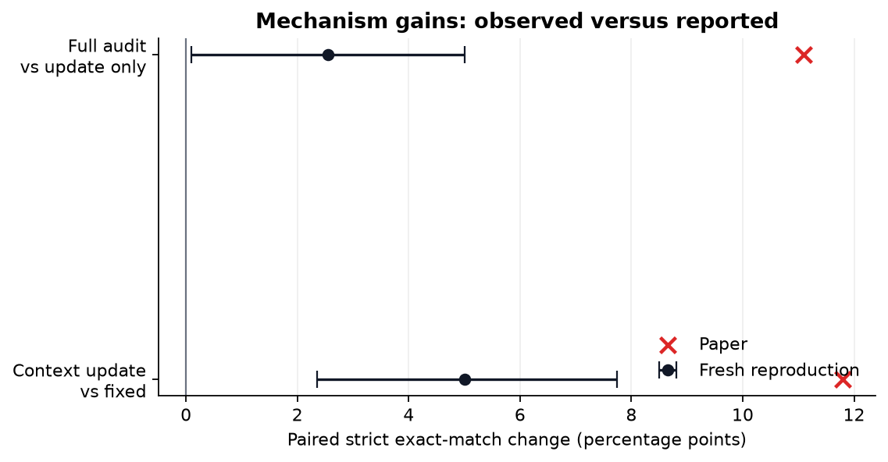
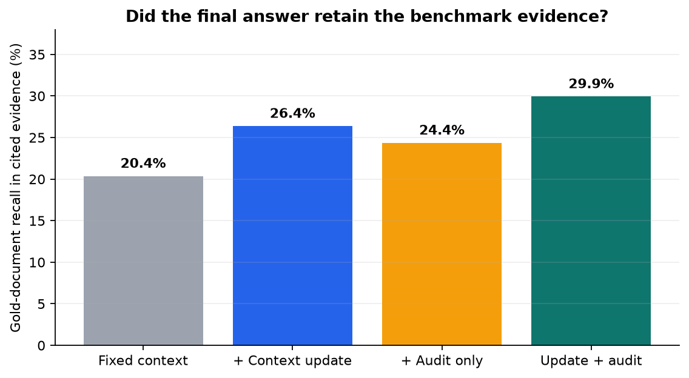
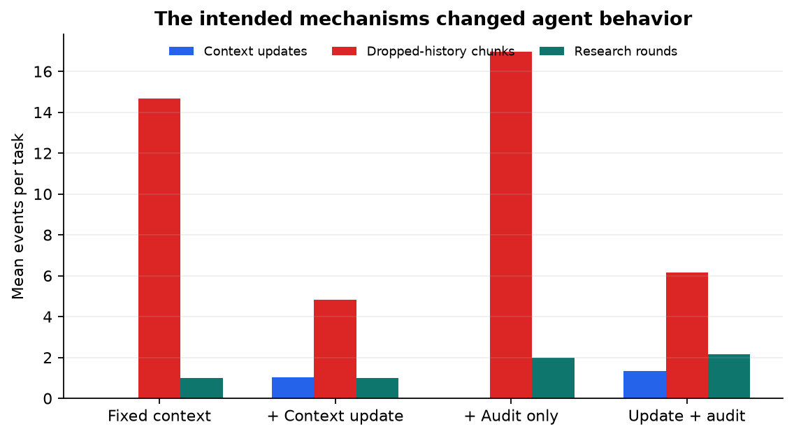
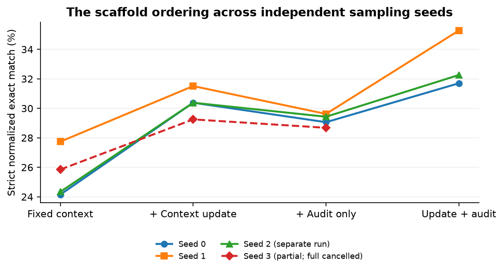

# Testing AREX’s two research loops on a public benchmark

Deep-research agents can lose useful evidence as a long investigation fills their working context, and they can stop before every clue has been checked. The AREX paper proposes two everyday remedies: let the agent rewrite its own working notes, then have a second loop audit each constraint and request targeted repairs. This reproduction tests whether those two inference-time ideas help a public 4-billion-parameter model on a frozen public research benchmark.

## Verdict

**Partially reproduced.** On the preregistered primary comparison, autonomous context updating improved strict exact-answer success by **5.00 percentage points** and gold-evidence retention by **6.01 points** over fixed context. Adding the outer audit improved strict success by a further **2.55 points**; its query-bootstrap interval was just above zero, while the exact binary discordance test was borderline. Both gains were smaller than the paper’s reported **+11.8** and **+11.1** points.

Scope: 530 held-out BrowseComp-Plus questions × 2 sampling seeds = 1,060 paired tasks per cell. This is a mechanism reproduction using public Qwen3.5-4B and offline BM25 search—not a reproduction of AREX’s proprietary training, prompts, checkpoint, or web environment.

Read the bars as strict normalized exact-match rates; whiskers are 95% query-cluster bootstrap intervals that keep both seeds of a question together. The progression from gray to blue supports the context-update claim. The teal full system is best, but its smaller margin over blue motivates the qualified verdict.

## What was tested

All four cells used the same 100,195-document frozen BrowseComp-Plus corpus, Qwen/Qwen3.5-4B checkpoint, 32 search/open tool-call cap, 60,000 shared completion-token cap, temperature, and deterministic evaluator:

| Cell | Changed mechanism |
|---|---|
| Fixed context | Research loop with search, open-document, and structured finish |
| Context update | Adds an agent-invoked rewrite of retained evidence and working state |
| Audit only | Adds constraint-wise accept/refine/restart rounds, without updates |
| Update + audit | Combines both mechanisms |

The independent checker measured strict normalized exact match and recall of benchmark gold documents in the final citations. Every model call—including audit and forced-finish calls—charged one shared budget counter. Earlier setup runs with an uncharged counter were excluded from primary evidence.

The implementation path is compact: `repro/driver.py` schedules matched tasks, `repro/scaffold.py` implements the inner and outer loops, `repro/tools.py` freezes retrieval, and `repro/checker.py` scores answers without model judgment.

## Finding 1: updating context helped

Context updating raised strict exact match from **25.94% to 30.94%**. The paired gain was **+5.00 points** (95% CI **+2.36 to +7.74**), with 129 discordant wins versus 76 losses (exact McNemar **p=0.000262**). It also raised gold-document evidence recall from **20.37% to 26.38%**, a **+6.01-point** gain (95% CI **+3.78 to +8.26**).

This matters because exact answers alone could improve through lucky guessing. The citation result shows that the updated agent more often carried benchmark-supported evidence through to its final structured answer.

## Finding 2: auditing added a smaller gain

The combined system reached **33.49%** strict exact match, **+2.55 points** over context updating alone. Its query-cluster interval was **+0.09 to +5.00**, but the exact McNemar test gave **p=0.057** (107 wins, 80 losses). Guarded answer accuracy improved **+2.74 points** (**p=0.036**), and evidence recall improved **+3.55 points** (95% CI **+1.64 to +5.50**). The claim is directionally aligned, but weaker and less decisive than the paper.

The factorial controls behaved coherently: audit-only beat fixed context by **+3.40 points** (**p=0.0052**), while the full system beat audit-only by **+4.15 points** (**p=0.0011**). This argues against the headline being an accidental ordering of four unrelated prompts.

The behavioral counters confirm that the interfaces were used. Context updating averaged 1.02 rewrites per task and cut dropped-history chunks from 14.68 to 4.83. Audit cells used about two research rounds rather than one.

## Robustness and interpretation

The seed plot separates sampling seeds rather than pooling away variability. On independent seed 2, context updating again helped: **+6.04 strict points** (95% CI +2.45 to +9.62; **p=0.0014**). Full versus update-only was again positive but uncertain: **+1.89 points** (95% CI −1.32 to +5.09; **p=0.295**), while evidence recall improved +3.00 points. Partial seed 3 also favored context updating by **+3.40 points** (95% CI +0.19 to +6.60) and evidence by +4.71 points. Its full cell is omitted: two Kubernetes attempts were externally cancelled after active partial execution but before terminal aggregates, so neither partial log counts as evidence.

The public checkpoint therefore invoked updates reliably across four seeds, but the outer controller spent substantially more tokens and sometimes revised a correct answer away; those dynamics likely explain its modest net gain.

The paper reported BrowseComp accuracies of 59.6, 71.4, 69.8, and 82.5 for its four analogous cells. Absolute levels are not directly comparable: this reproduction substitutes a base public 4B checkpoint, 24K context, offline lexical retrieval, public BrowseComp-Plus, and reconstructed prompts for a trained proprietary AREX system with a live-search environment. The result therefore supports the two mechanisms under this public setup, not the full system claim or the reported effect sizes.

| Claim | Paper | Observed primary result | Assessment | Primary compute |
|---|---:|---:|---|---|
| Context update vs fixed | +11.8 pp | +5.00 pp exact; +6.01 pp evidence | Aligned, smaller | Kubernetes; 4 GPUs/cell; 1h22m and 1h06m |
| Full vs context update | +11.1 pp | +2.55 pp exact; +3.55 pp evidence | Directionally aligned; strict test borderline | Kubernetes; 4 GPUs/cell; 1h42m and 1h06m |

## Compute and reproducibility

Every evidence-bearing run used the OpenResearch **Kubernetes** backend on **NVIDIA RTX PRO 6000 Blackwell** GPUs, with a peak of **16 GPUs concurrently allocated**. The fresh campaign’s actual elapsed wall time was **5.29 hours** (2026-07-25 20:32:25Z to 2026-07-26 01:49:46Z). The exact command on every experiment branch was `bash repro/run.sh`; aggregate results are in `results/clean_rerun_summary.json`, and the notebook embeds the evidence so opening it in Molab does not rerun expensive experiments.

Primary experiment branches: [fixed context](https://github.com/alphaXiv/arex-towards-a-recursively-self-improving-agent/tree/orx/budget-verified-base-fixed-context-530q-x-2-seed), [context update](https://github.com/alphaXiv/arex-towards-a-recursively-self-improving-agent/tree/orx/budget-verified-acu-context-update-530q-x-2-seed), [audit only](https://github.com/alphaXiv/arex-towards-a-recursively-self-improving-agent/tree/orx/budget-verified-audit-outer-controller-530q-x-2), and [full controller](https://github.com/alphaXiv/arex-towards-a-recursively-self-improving-agent/tree/orx/budget-verified-full-acu-plus-audit-530q-x-2-see).
